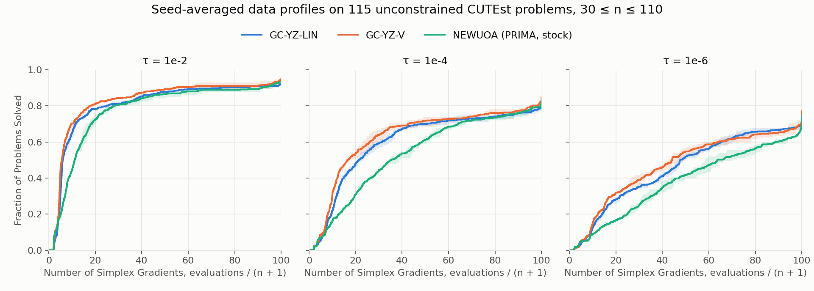

# GC-YZ-(LIN/V)

This repository contains an implementation of a derivative-free trust-region optimization algorithm for unconstrained black-box functions. On each iteration, a quadratic interpolation model is constructed and minimized over a ball. This implementation differs from conventional derivative-free trust-region methods in the following ways:

- **Two-tier interpolation set**. The interpolation set is split into $\mathcal Y$ and $\mathcal Z$, where geometry is managed explicitly using Lagrange polynomials in $\mathcal Y$ and an unmanaged $\mathcal Z$ receives points displaced in $\mathcal Y$. This yields a two-stage discard cycle.
- **"Hedge" fitting procedure**. A minimum-Frobenius-norm-change model and a minimum-Frobenius-norm model are fit on each iteration, and the one with the better recent performance is used.
- **Geometry management with complexity guarantees.** We follow a principled framework for geometry correction that allows for the development of a worst-case complexity bound, in terms of function evaluations.

We serve two algorithms:

* **GC-YZ-LIN** (default) : uses linear Lagrange management of the
  interpolation set $\mathcal Y$, self-correcting geometry, a resolution ladder, and the hedged model.
* **GC-YZ-V**: GC-YZ-LIN plus an admission test for rejected trial points, a
  re-anchor mechanism of the least-change model, a "usefulness gate", and two guards (far distance and poisedness) before the resolution ladder advances. Note that this variant is not yet accompanied by any complexity guarantees.

The methods and analysis are described in the paper: https://arxiv.org/pdf/2609.09441.

## Install

```bash
pip install .            # numpy >= 1.24, scipy >= 1.10
pip install ".[rescue]"  # adds cvxpy, used only by the hessian_cap refit
```

## Quick start

### Sample Usage
```python
import numpy as np, gcyz

def f(x):
    return float(np.sum(100 * (x[1:] - x[:-1] ** 2) ** 2 + (1 - x[:-1]) ** 2))

res = gcyz.minimize(f, np.zeros(10), budget=2000)               # GC-YZ-LIN (default)
res = gcyz.minimize(f, np.zeros(10), budget=2000, variant="V")    # GC-YZ-V
print(res.x, res.fun, res.nfev, res.message)
```
### Full Function Signature
`gcyz.minimize(fun, x0, budget, variant="LIN", options=None, *, fx0=None, rng=None, keep_x=False)`

| argument | meaning |
|---|---|
| `fun` | callable `f(x) -> float` |
| `x0` | starting point, shape `(n,)` with n ≥ 1 |
| `budget` | maximum number of function evaluations, including the initial sample. Values smaller than 2n+1 raises `ValueError`|
| `variant` | `"LIN"` (default) or `"V"` |
| `options` | overrides of `gcyz.DEFAULT_OPTIONS` (table below) |
| `fx0` | `f(x0)` if already known (saves one evaluation); used as given, `fun` is not called at `x0` |
| `rng` | `numpy.random.Generator` used when `init_frame="random"` |
| `keep_x` | record every evaluated point in `res.info["x_history"]` |

### Result

| field | meaning |
|---|---|
| `x`, `fun` | the best point evaluated and its value (±1e200 for a failed or −inf value) |
| `nfev` | number of evaluations |
| `fval_history` | every evaluated value, in order (NaN and +inf recorded as +1e200, −inf as −1e200; no `f(x0)` when `fx0` is given) |
| `message` | why the run stopped |
| `info` | counters of what the algorithm did (geometry repairs, gate firings, which model was used, ...) and the final state (`tr_final`, `rho_final`, `delta_history`, `stop_reason`); print `res.info` to see them all |

### Errors

- If `fun` raises an error, `minimize` re-raises it unchanged, with the best point so far attached as
  `err.gcyz_result`. The same holds for the `TypeError` raised when `fun` does not return a real number.
- A starting point so large that a design point `x0 ± Δ₀ q_i` rounds to `x0` raises `ValueError`: rescale the
  problem, or set `tr_delta` to the scale of `x0`.
- If the model's linear algebra breaks down (for example on non-finite data), the run stops early and returns the
  best point so far; `message` starts with `degenerate model` or `stopped early` (the latter also issues a
  `RuntimeWarning`).

## Options

| option | default | meaning |
|---|---|---|
| `tr_delta` | 0.5 | starting radius Δ₀ (also the spacing of the starting points `x0 ± Δ₀ q_i`) |
| `tr_toaccept` | 0.01 | η₁: a step is accepted if the actual decrease is at least η₁ times the predicted decrease |
| `tr_toexpand` | 5e-9 | η₂: the gradient counts as small when ‖g‖ < η₂ Δ |
| `tr_expand`, `tr_shrink` | 1.3, 0.8 | radius factors after an accepted / rejected step |
| `rho_shrink`, `rhoend` | 0.1, 1e-12 | ρ is the smallest radius allowed for a resolution; after a resolution is exhausted, ρ is multiplied by `rho_shrink`, down to `rhoend`, where the run then stops |
| `small_step_gate` | 0.5 | c_g ≤ 1: a trial step shorter than c_g·ρ is not evaluated; Y is repaired if needed, otherwise the radius shrinks (0: off) |
| `gate_far_mult` | 5 (GC-YZ-V: 0) | m: when that gate fires, a Y point farther than m·Δ is replaced first (0: off; GC-YZ-V uses `rho_advance_far_gate` instead) |
| `sample_max` | `"2*n+1"` | total number of sample points (a number or a formula in `n`), from n + 1 to (n + 1)(n + 2)/2 |
| `big_lambda` | 1000 | Λ: Y is repaired (one evaluation) when its poisedness is above Λ |
| `sc_lambda` | 2 | after a rejected step, the trial point replaces a Y point if its Lagrange value there is above this |
| `self_correcting` | True | turn that replacement on or off |
| `init_frame` | `"identity"` | starting points along the coordinate axes, or `"random"` (randomly rotated axes) |
| `model` | `"hedge"` | `"hedge"` (fit both models below and use the one that has been predicting better), `"mfn"` (smallest-Hessian fit), `"chain"` (fit closest to the previous model) |
| `hedge_beta`, `hedge_hysteresis`, `hedge_warmup` | 0.8, 0.8, 1 | hedge: weight on past prediction errors; how much better the other model must be to switch; steps scored before switching |
| `hessian_cap` | 1e100 | K: a model with ‖H‖ > K is refit with ‖H‖ ≤ K; if the refit fails, the linear model is used (0 or `None`: off) |
| `hedge_chain_max_err` | (LIN: None), (V: 1.0) | use the `"chain"` model only while its prediction error is below this |
| `mcfn_scale_reseed` | (LIN: 0), (V: 2.0) | restart the `"chain"` model when Δ has grown by this factor since it started (0: off) |
| `newuoa_admission`, `nwa_margin`, `nwa_no_discard` | (LIN: False, 0, False), (V: True, 0.25, True) | GC-YZ-V's update after a rejected step: the trial point replaces the sample point with the largest weighted Lagrange value if that value is above 1 + margin; otherwise it goes to Z (`nwa_no_discard`) or is dropped |
| `rho_advance_far_gate`, `rho_advance_lambda_gate` | (LIN: 0, 0), (V: 10, 1000) | before ρ is lowered: replace a Y point farther than `far_gate`·Δ, or repair Y if its poisedness is above `lambda_gate` |
| `stop_iter` | 100000 | maximum number of iterations (the evaluation limit comes from `budget`) |
| `verbosity` | 0 | 1 prints a line for each geometry action and the reason the run stopped |


$\mathcal Y$ always holds $n$ points managed with linear Lagrange polynomials, the setting the paper analyses; all
other points go to $\mathcal Z$. Managing $\mathcal Y$ with other Lagrange bases (for example quadratic ones) is not
implemented. For $n \leq 5$ we recommend a full quadratic interpolation set of $\frac{(n+1)(n+2)}{2}$ points:
`options={"sample_max": "(n+1)*(n+2)//2"}`. For $n > 5$ use the defaults ($2n + 1$ points).

## Failed evaluations

A returned value of exactly `1e200` or beyond counts as a failed evaluation (the stand-in value for NaN and +inf). `fx0 = -inf` ends the run at `x0` like an evaluation returning −inf. A failed value is never interpolated:

- **trial point:** an unsuccessful step; it goes to $\mathcal Z$ with the value f(x_k) + predicted decrease, so the
  model steers away from it;
- **repair point:** retried at its mirror image; if both fail, the radius shrinks (at the floor, the run stops);
- **design point:** in $\mathcal Y$, replaced by the opposite design point or dropped; in $\mathcal Z$, dropped. A
  $\mathcal Y$ left short is refilled by the next geometry repair;
- **`f(x0)`:** the run continues from the first finite point it accepts.

> **Note.** Beyond small tests, their effect on performance is unexplored (no evaluation in the CUTEst benchmark
> below failed). The steps above are used to keep the algorithm running (for example when objective functions get prohibitively large and yield overflow errors).

<!-- cutest-n30-benchmark:start -->
## Benchmark: CUTEst problems with n ≥ 30



Above are the data profiles of GC-YZ-LIN, GC-YZ-V and stock NEWUOA from the PRIMA package on 115 unconstrained CUTEst problems with dimension 30 ≤ n ≤ 110, listed in
[`benchmarks/cutest_n30_problems.txt`](benchmarks/cutest_n30_problems.txt), averaged over four random initial frames. The x-axis counts function evaluations in units of n + 1 (simplex gradients), with n the dimension of each problem. Lines are the mean over the four frames,
and the shading is the range of the curves. A curve that is up and to the left indicates better performance.

Frames: for seed s = 1, …, 4 a random orthogonal matrix Q is drawn and GC-YZ starts from the design
x0 ± 0.5 q_i (`init_frame="random"`). NEWUOA's initial design is fixed to the coordinate axes, so it minimises the
rotated problem f(x0 + Q (z − x0)) from z0 = x0, which makes its first 2n + 1 points identical to GC-YZ's.

Per-problem convergence plots of the same runs are in [`benchmarks/convergence/`](benchmarks/convergence/).

### Reproducing Results

[`examples/cutest_s2mpj.py`](examples/cutest_s2mpj.py) runs both GC-YZ variants on problems from the list in one of
the benchmark's start frames (`--seed s`, s = 1 to 4, default 1) with the benchmark settings, and prints how many
simplex gradients each needed to reach each tolerance; the data profiles are built from these counts, averaged over
the frames. The reference values f_ref of every problem and frame, and the problem sizes, are in
[`benchmarks/cutest_n30_reference.json`](benchmarks/cutest_n30_reference.json). Stock NEWUOA is not part of this
package and is not run by the script. It needs an S2MPJ checkout. With no problem names it runs WATSON, BROYDN3DLS
and ARWHEAD; any problems from the list can be named instead:

```bash
git clone https://github.com/GrattonToint/S2MPJ
OPENBLAS_NUM_THREADS=1 python examples/cutest_s2mpj.py --s2mpj ./S2MPJ
OPENBLAS_NUM_THREADS=1 python examples/cutest_s2mpj.py --s2mpj ./S2MPJ --seed 3 WATSON BROYDN3DLS
```

Output of the first command on our machine with the code as committed here:

```
start frame R1 (numpy.random.seed(1), init_frame='random'); budget 100 simplex gradients
                                                      simplex gradients to reach tau   
problem         n  solver           best f  evals         1e-02       1e-04       1e-06
WATSON         31  GC-YZ-LIN    7.0908e-05   3200          9.09       65.44       90.97   (41 s)
WATSON         31  GC-YZ-V      7.6030e-04   3200         18.81       56.50           -   (41 s)
BROYDN3DLS     50  GC-YZ-LIN    2.0781e-23   2333          5.53       10.25       14.71   (44 s)
BROYDN3DLS     50  GC-YZ-V      1.0379e-22   2614          5.90       10.00       14.84   (51 s)
ARWHEAD       100  GC-YZ-LIN    1.0325e-14   4006          4.10        7.94       10.52   (253 s)
ARWHEAD       100  GC-YZ-V      9.1038e-15   3863          2.23        7.48       13.45   (244 s)
```
<!-- cutest-n30-benchmark:end -->

## Citation

If you use this software in your research, please cite the following paper:

```bibtex
@misc{ChaudhryScheinbergSun2026,
  title         = {Powell-Style Model-Based Derivative-Free Optimization with Complexity Guarantees},
  author        = {Chaudhry, Abraar and Scheinberg, Katya and Sun, Scholar},
  year          = {2026},
  eprint        = {2609.09441},
  archivePrefix = {arXiv},
  primaryClass  = {math.OC},
  doi           = {10.48550/arXiv.2609.09441},
  url           = {https://arxiv.org/abs/2609.09441}
}
```

## AI disclosure

Large language models were used for the development and testing of this repository. Published code has been reviewed by the authors and we take full responsibility for its correctness.

## Licence

This repository is licensed under GNU General Public License v3.0 or later (see `LICENSE`). Note that `gcyz/trust_sub.py` originates from the DFO-TR code of Liyuan Cao and Anahita Hassanzadeh.
